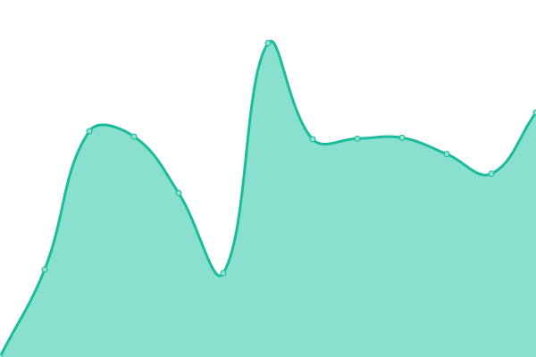

# [📈 Live Status](https://gjlawran.github.io/apsmon): <!--live status--> **🟩 All systems operational**

This repository contains the open-source uptime monitor and status page for [Greg Lawrance](https://gjlawran.github.io/apsmon), powered by [Upptime](https://github.com/upptime/upptime).

With [Upptime](https://upptime.js.org), you can get your own unlimited and free uptime monitor and status page, powered entirely by a GitHub repository. We use [Issues](https://github.com/gjlawran/apsmon/issues) as incident reports, [Actions](https://github.com/gjlawran/apsmon/actions) as uptime monitors, and [Pages](https://gjlawran.github.io/apsmon) for the status page.

<!--start: status pages-->
<!-- This summary is generated by Upptime (https://github.com/upptime/upptime) -->
<!-- Do not edit this manually, your changes will be overwritten -->
<!-- prettier-ignore -->
| URL | Status | History | Response Time | Uptime |
| --- | ------ | ------- | ------------- | ------ |
|  [BCDC APIs List](https://catalogue.data.gov.bc.ca/dataset?type=WebService&download_audience=Public) | 🟩 Up | [bcdc-ap-is-list.yml](https://github.com/gjlawran/apsmon/commits/HEAD/history/bcdc-ap-is-list.yml) | 

 254ms
     
 | 

<a href="https://gjlawran.github.io/apsmon/history/bcdc-ap-is-list">99.84%</a>
    

|  [BCGov News API](https://news.api.gov.bc.ca/api/Home?api-version=1) | 🟩 Up | [bc-gov-news-api.yml](https://github.com/gjlawran/apsmon/commits/HEAD/history/bc-gov-news-api.yml) | 

 183ms
     
 | 

<a href="https://gjlawran.github.io/apsmon/history/bc-gov-news-api">100.00%</a>
    

|  [Address Geocoder](https://geocoder.api.gov.bc.ca/addresses.json?addressString=525%20Superior%20Street%2C%20Victoria%2C%20BC) | 🟩 Up | [address-geocoder.yml](https://github.com/gjlawran/apsmon/commits/HEAD/history/address-geocoder.yml) | 

 180ms
     
 | 

<a href="https://gjlawran.github.io/apsmon/history/address-geocoder">100.00%</a>
    

<!--end: status pages-->

[**Visit our status website →**](https://gjlawran.github.io/apsmon)

## 📄 License

- Powered by: [Upptime](https://github.com/upptime/upptime)
- Code: [MIT](./LICENSE) © [Greg Lawrance](https://gjlawran.github.io/apsmon)
- Data in the `./history` directory: [Open Database License](https://opendatacommons.org/licenses/odbl/1-0/)
